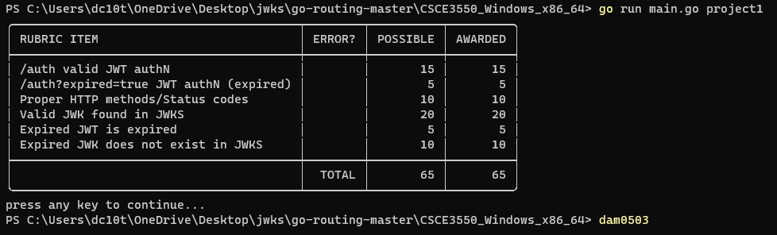

# Project 1: JWKS Server

## Running the Server
Open a terminal window in the root directory. Then, enter the following command. The server will remain open for 100 hours or until the user exits it via something like a Keyboard Interrupt.
```
go run main.go route.go
```

## Test Suite
Open a terminal window in the root directory. Then, enter the following commands in the following order.
```
go test -v ./... -coverprofile profile.out
go tool cover -func profile.out
go tool cover '-html=profile.out' -o testcoverage.html
```

## Screenshots

