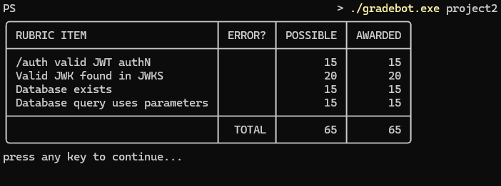

# Project 1: JWKS Server

## Running the Server
Open a terminal window in the root directory. Then, enter the following command. The server will remain open for 100 hours or until the user exits it via something like a Keyboard Interrupt.
```
go run main.go route.go
```
If this doesn't work, you can place it in a .bat file with the following lines
```
set CGO_ENABLED=1
go run main.go route.go
```

Accessing a specific kid can be done with the following URL, if it is not expired: http://localhost:8080/.well-known/00014.json

## Test Suite
Open a terminal window in the root directory. Then, enter the following commands in the following order.
```
go test -v ./... -coverprofile profile.out
go tool cover -func profile.out
go tool cover '-html=profile.out' -o testcoverage.html
```

## Fixing a CGO Error
If you see the error of
```
# runtime/cgo
cc1.exe: sorry, unimplemented: 64-bit mode not compiled in
```
perform the following steps.
 1. Install the tdm-gcc-64 bundle
 2. Add that to the path
 3. If the issue is still having issues, alter `go env` to point to tdm

## Screenshots


