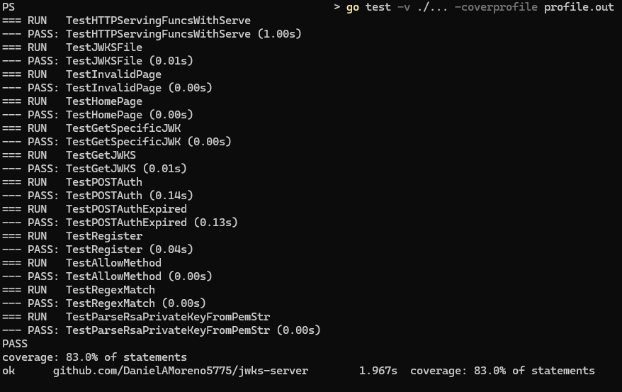

# Go-based JWKS Server

## Running the Server
Open a terminal window in the root directory. Then, enter the following command. The server will remain open for 100 hours or until the user exits it via something like a Keyboard Interrupt.
```
go run main.go route.go
```
CGO is necessary for the SQLite database to be accessed. If this program doesn't work due to CGO being disabled, you can create a .bat file (assuming a Windows computer) with the following lines:
```
set CGO_ENABLED=1
go run main.go route.go
```

## Capabilities

This program will serve up a web server on port 8080.
 * If an invalid request or page is accessed, it will return a 405 error code.
 * On a POST request, the /register page will accept a username and email from a JSON payload, and it returns a password which is a random UUID. In addition, this will save the following details in the database: username, email, date registered, and salted Argon2 hash of the password.
 * On a POST request which has passed a JSON payload containing the username and password, the /auth page will return an unexpired JWT signed by a private RSA key. If the expired query parameter is passed, the signed JWT will be expired. The associated private key will be stored in the SQLite database, encoded in PKCS1 PEM format and encrypted with AES-256 GCM. In addition, this creates a log entry in the database which tracks the request IP address, timestamp, and user ID. The /auth page is also protected by a rate limiter which returns a 429 error code if more than 10 requests are made per second.
 * On a GET request, the /jwks page will return a JWKS for the private keys in the database. All SQL actions are parameterized to prevent injection. I used a custom test suite and a test suite provided as part of the assignment.
 * On a GET request, the /.well-known/#.json page will return the JWK for a specific, non-expired key in the database. Accessing a specific kid can be done with the following URL: http://localhost:8080/.well-known/164.json.

## Test Suite
Open a terminal window in the root directory. Then, enter the following commands in the following order.
```
go test -v ./... -coverprofile profile.out
go tool cover -func profile.out
go tool cover '-html=profile.out' -o testcoverage.html
```

## Fixing a CGO Error
If you see the error of
```
# runtime/cgo
cc1.exe: sorry, unimplemented: 64-bit mode not compiled in
```
perform the following steps (assuming a Windows computer):
 1. Install the tdm-gcc-64 bundle for x86-64
 2. Add the file path to the PATH variable (Example: C:\TDM-GCC-64\bin)
 3. Move that file path to the top of the PATH variable list to prevent conflicts
 4. If the issue persists, alter `go env` to point to that file path

## Fixing a Frozen Screen
If you ran `go run main.go route.go` but never got the response of `Server listening on port :8080`,
 1. Try entering Ctrl+C once. If the response above appears, the problem is fixed.
 2. Try entering Ctrl+C once. This should print an exit status and return you to the command line. If not, skip to 4.
 3. If you are back at the command line, try to run the program again.
 4. If you aren't back at the command line, try Ctrl+Pause|Break to return to the command line. If this worked, return to 3.

## Screenshots



